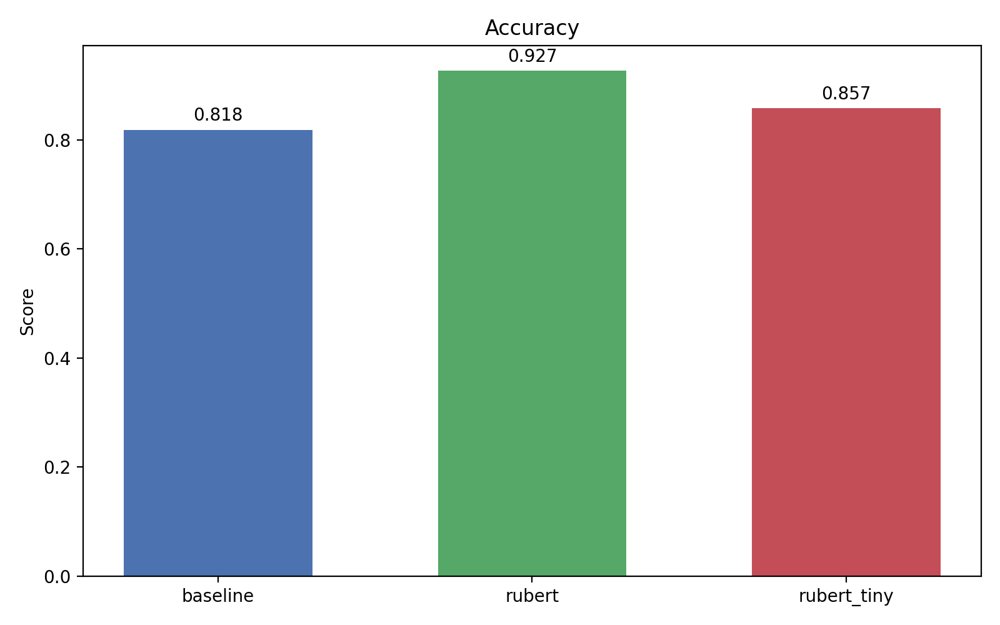
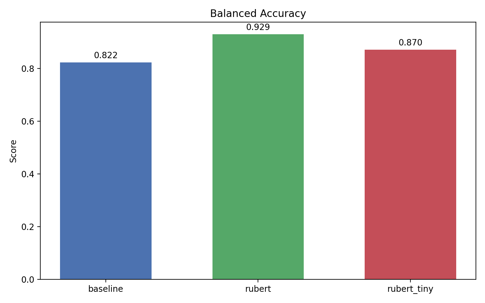
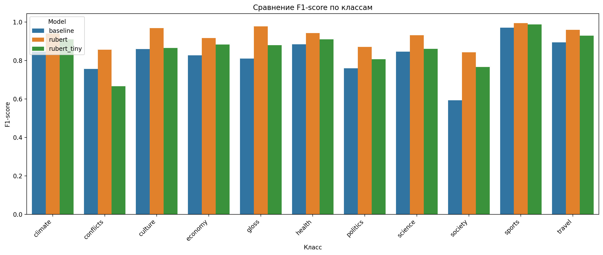
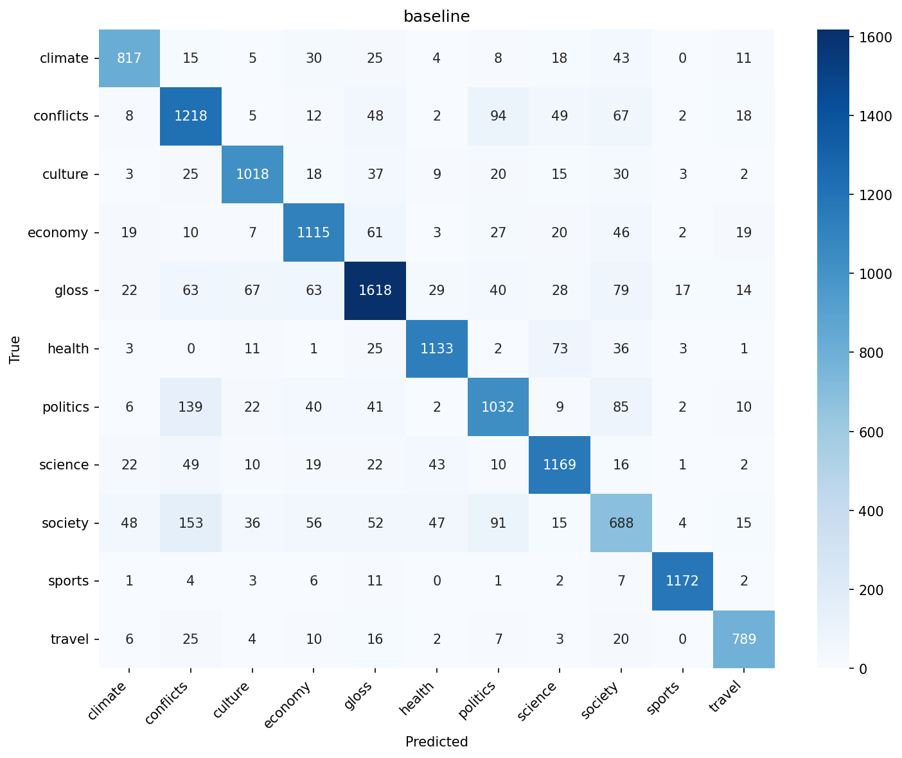
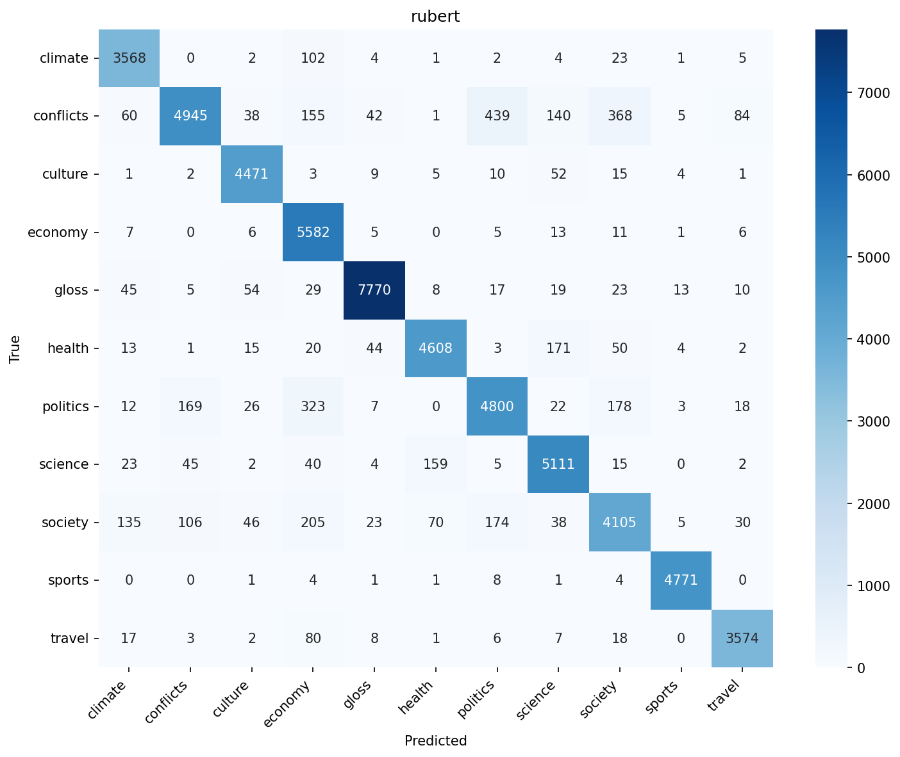
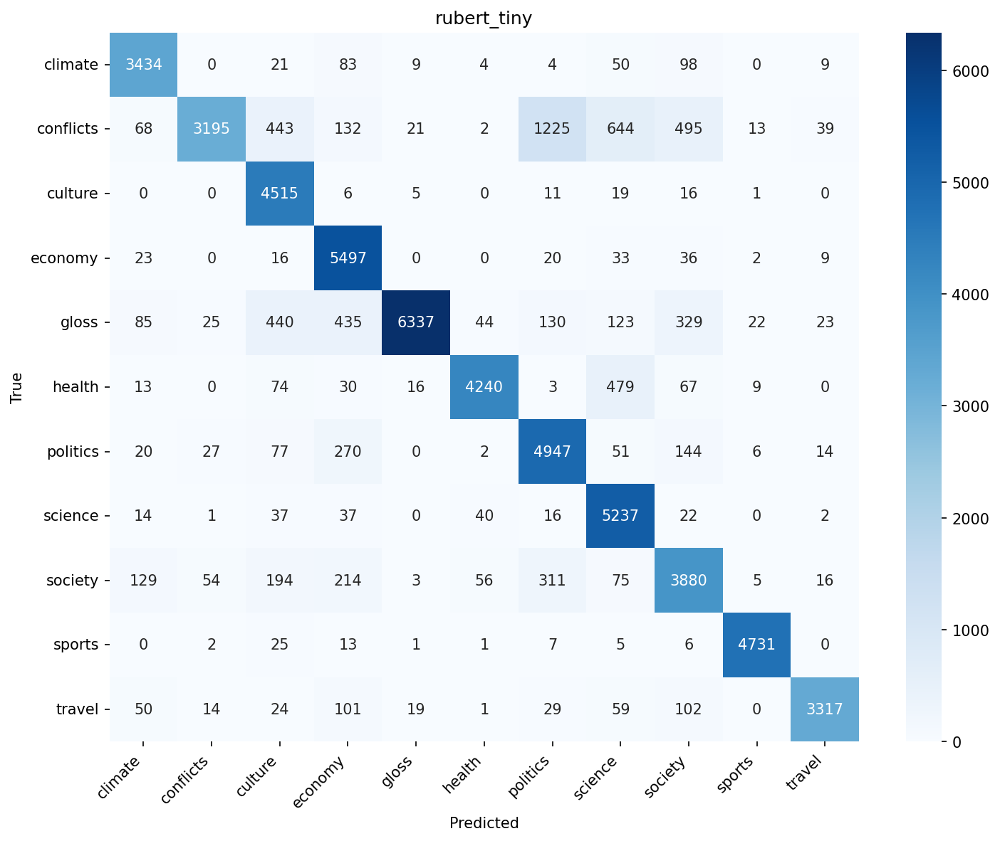

# Классификатор русских новостей

Проект для классификации русскоязычных новостей по 11 тематическим категориям с использованием различных подходов машинного обучения и глубокого обучения.

## Сравнение моделей

| Модель | Accuracy | Macro F1 | Balanced Acc | Cohen's Kappa | ROC-AUC (macro) |
|--------|----------|----------|--------------|---------------|-----------------|
| **ruBERT** (base) | **92.66%** | **92.70%** | **92.93%** | **91.89%** | **99.67%** |
| ruBERT-tiny | 85.75% | 86.02% | 87.04% | 84.28% | 99.40% |
| MLP (Baseline) | 81.83% | 82.22% | 82.25% | 79.91% | 98.05% |

## Визуализация результатов

### Сравнение метрик моделей

| Метрика | MLP | ruBERT | ruBERT-tiny |
|---------|-----|--------|-------------|
| Accuracy |  | | |
| Macro F1 |  | | |
| Balanced Accuracy |  | | |
| Cohen's Kappa |  | | |

### Per-class F1-score



### Confusion Matrices

| MLP | ruBERT | ruBERT-tiny |
|-----|--------|-------------|
|  |  |  |

## Архитектура проекта

```
rus_news_classifier/
├── src/                          # Основной код
│   ├── config.py                 # Конфигурация проекта
│   ├── data_loader.py            # Загрузка и предобработка данных
│   ├── model/                    # Модели
│   │   ├── baseline.py          # MLP (Baseline)
│   │   └── ruBERT.py            # ruBERT и ruBERT-tiny
│   ├── utils/                    # Утилиты
│   │   ├── metrics.py           # Метрики и визуализация
│   │   ├── preprocessing.py     # Предобработка текста
│   │   ├── tf_idf.py            # TF-IDF векторизация
│   │   └── create_dataloader.py # DataLoader для PyTorch
│   ├── train_baseline.py         # Обучение MLP
│   ├── train_transformer.py      # Обучение ruBERT
│   ├── train_ruBERT_tiny.py      # Обучение ruBERT-tiny
│   └── compare_models.py         # Сравнение моделей
├── news_classifier/              # Django web-приложение
│   ├── classifier/               # Приложение классификации
│   └── news_classifier/          # Настройки Django
├── notebook/                     # Jupyter notebooks
├── plots/                        # Графики и метрики
├── data/                         # Данные (raw/processed)
├── models/                       # Сохраненные модели
├── requirements.txt              # Зависимости
└── README.md
```

## Запуск

### 1. Установка зависимостей

```bash
pip install -r requirements.txt
```

### 2. Загрузка и предобработка данных

```bash
python3 src/data_loader.py
```

Данные загружаются из Hugging Face dataset `data-silence/rus_news_classifier`.

### 3. Обучение моделей

#### MLP (Baseline):

```bash
python3 src/train_baseline.py
```

#### ruBERT (base):

```bash
python3 src/train_BERT.py
```

#### ruBERT-tiny:

```bash
python3 src/train_BERT_tiny.py
```

### 4. Сравнение моделей

```bash
python3 src/compare_models.py
```

Этот скрипт оценивает все три модели и генерирует сравнительные метрики и графики.

### 5. Запуск веб-интерфейса

```bash
cd news_classifier
python3 manage.py migrate
python3 manage.py runserver
```

Откройте браузер по адресу `http://localhost:8000`.

## Данные

Проект использует датасет [rus_news_classifier](https://huggingface.co/datasets/data-silence/rus_news_classifier) из Hugging Face, содержащий:

- **11 классов**: climate, conflicts, culture, economy, gloss, health, politics, science, society, sports, travel
- **Два набора**: train (57.5K записей) и test (14.4K записей)
- **Поля**: `news` (текст), `labels` (класс)

## Модели

### 1. MLP (Baseline)
- TF-IDF векторизация (5000 признаков, 1-2-gramмы)
- Два полносвязных слоя (5000 → 256 → 11)
- ReLU активация + Dropout (0.2)
- Adam оптимизатор

### 2. ruBERT (base)
- `ai-forever/ruBERT-base`
- Дропаут 0.3
- AdamW оптимизатор (lr=2e-5)
- Batch size: 8, Epochs: 3

### 3. ruBERT-tiny
- `cointegrated/rubert-tiny2`
- Дропаут 0.3
- AdamW оптимизатор (lr=2e-5)
- Batch size: 8, Epochs: 3

## Метрики (ruBERT - лучшая модель)

### Общие метрики
- **Accuracy**: 92.66%
- **Macro F1**: 92.70%
- **Balanced Accuracy**: 92.93%
- **Cohen's Kappa**: 91.89%
- **ROC-AUC (macro)**: 99.67%

### Per-class F1-score (ruBERT)

| Класс | Precision | Recall | F1-score |
|-------|-----------|--------|----------|
| climate | 91.94% | 96.12% | 93.98% |
| conflicts | 93.73% | 78.78% | 85.61% |
| culture | 95.88% | 97.77% | 96.82% |
| economy | 85.31% | 99.04% | 91.67% |
| gloss | 98.14% | 97.21% | 97.67% |
| health | 94.93% | 93.45% | 94.18% |
| politics | 87.77% | 86.36% | 87.06% |
| science | 91.63% | 94.54% | 93.06% |
| society | 85.34% | 83.15% | 84.23% |
| sports | 99.25% | 99.58% | 99.42% |
| travel | 95.77% | 96.18% | 95.97% |

## Использование

### Программное использование

```python
from src.model.ruBERT import ruBERT
from transformers import BertTokenizerFast
import torch

# Загрузка модели
model = ruBERT(num_classes=11)
model.load_state_dict(torch.load("models/bert/bert_model.pth"))
model.eval()

tokenizer = BertTokenizerFast.from_pretrained("models/bert/tokenizer")

# Классификация
text = "Новая научная разработка позволит лечить заболевания сердца"
encoding = tokenizer(text, max_length=64, padding="max_length", truncation=True, return_tensors="pt")

with torch.no_grad():
    outputs = model(encoding["input_ids"], attention_mask=encoding["attention_mask"])
    probs = torch.softmax(outputs, dim=1)
    pred_class = torch.argmax(probs, dim=1).item()
```

### CLI inference

```bash
# MLP
python3 src/predict_baseline.py

# ruBERT
python3 src/predict_BERT.py
```

## Производительность

| Модель | Параметры | Время обучения | GPU память |
|--------|-----------|----------------|------------|
| MLP | ~1.3M | ~5 мин | ~100 MB |
| ruBERT | ~109M | ~1.5 часf | ~4 GB |
| ruBERT-tiny | ~14M | ~20 мин | ~2 GB |

## Известные проблемы

1. **Несбалансированность данных**: Класс `conflicts` имеет меньшее количество примеров, что влияет на Recall.
2. **Класс gloss**: Высокая точность, но низкий Recall - модель осторожно предсказывает этот класс.

## Лицензия

MIT License

## Автор

Бабиков Данил Александрович

---

<div align="center">
  
  
  
</div>
